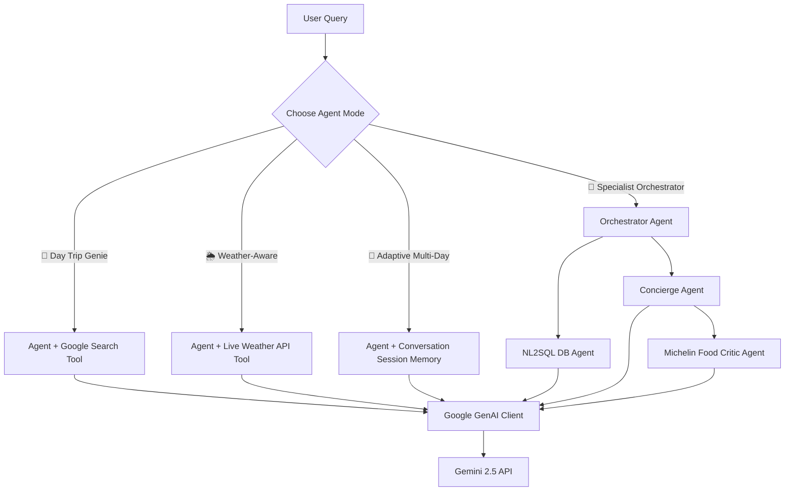

# ✈️ Travel Planner Agent Suite (Google ADK)

A production-grade, conversational travel planner application built using **Google's Agent Development Kit (ADK)**, the **Google GenAI SDK**, and **Streamlit**. 

This application exposes an interactive chat dashboard that lets you test four distinct specialized RAG and tool-use agent configurations, displaying real-time reasoning logs and tool execution traces.

---

## 🌟 Key Features & Agent Modes

1. **🧞 Day Trip Genie**: Specialized in creating spontaneous full-day itineraries based on mood, interests, and budget. Integrates the `google_search` tool to look up local attractions, schedules, and pricing on-the-fly.
2. **🌦️ Weather-Aware Planner**: Plans outdoor excursions (hiking, beaches, etc.) by automatically querying the National Weather Service (NWS) API or fallbacks for real-time temperature and conditions before making suggestions.
3. **🧠 Adaptive Multi-Day Planner**: Progressively builds a multi-day itinerary day-by-day. Uses short-term conversation session memory to adapt plans based on user feedback (e.g., "replace museums on Day 1") while keeping unchanged segments intact.
4. **🏢 Specialist Orchestrator**: Demonstrates multi-agent coordinator workflows. A top-level orchestrator agent connects to an NL2SQL database retriever mock agent to fetch hotels, then routes recommendations through a concierge agent, which calls a specialist food critic agent to select dining spots.

---

## 📐 System Architecture



---

## 🛠️ Step-by-Step Installation Tutorial

### 1. Prerequisites
Make sure you have **Python 3.10+** installed.

### 2. Clone the Repository
```bash
git clone https://github.com/rajivchandak25/Trip-planner-agent-using-ADK.git
cd Trip-planner-agent-using-ADK
```

### 3. Set Up Environment & Dependencies
```bash
# Create a virtual environment
python -m venv .venv

# Activate on Windows:
.venv\Scripts\activate

# Activate on macOS/Linux:
source .venv/bin/activate

# Install required packages
pip install -r requirements.txt
```

### 4. Run the Application
Start the Streamlit dashboard locally:
```bash
streamlit run app.py
```
Open **`http://localhost:8501`** in your browser. Enter your Google Gemini API Key in the sidebar to authenticate and start planning.

---

## 🚀 How to Deploy to Streamlit Cloud

To make this app accessible to anyone, you can host it for free on Streamlit Community Cloud:

1. **Push Code**: Ensure all files (`app.py`, `agents.py`, `ui_theme.py`, `requirements.txt`) are committed and pushed to your GitHub repository.
2. **Deploy on share.streamlit.io**:
   * Navigate to **[https://share.streamlit.io](https://share.streamlit.io)** and log in with your GitHub account.
   * Click **New app** in the upper-right corner.
   * Select your repository: `rajivchandak25/Trip-planner-agent-using-ADK`
   * Set **Branch** to `main` and **Main file path** to `app.py`.
   * Click **Deploy!**
3. **Configure API Key (Optional)**:
   * To deploy the app with a default API key (so users don't have to input their own), open the app settings in the Streamlit Cloud dashboard.
   * Go to **Secrets** and add your Gemini API key:
     ```toml
     GEMINI_API_KEY = "your-actual-api-key-here"
     ```
     Lumina will automatically pick up this secret and configure the agents on load.
